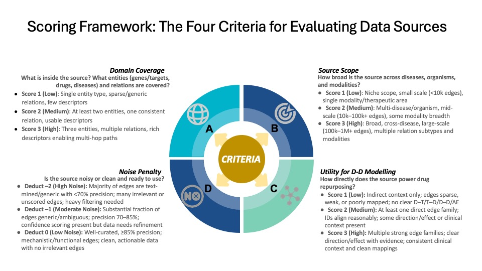

# Biomedical Knowledge Source Relevance Scoring for Drug Repurposing

A reproducible scoring rubric for evaluating the relevance of primary knowledge sources (PKS) ingested into biomedical knowledge graphs (KGs), specifically for **AI-aided drug repurposing**.

Developed as part of the [ Every Cure Matrix project](https://github.com/everycure-org/matrix).

---

## Overview

Biomedical KGs like [The Monarch KG](https://monarchinitiative.org/), [ROBOKOP](https://robokopkg.renci.org/), and [RTX-KG2](https://github.com/RTXteam/RTX-KG2) ingest dozens of heterogeneous knowledge sources. Not all sources are equally useful for drug-disease modeling. This rubric provides a **structured, reproducible method** to score each source on four criteria and assign a `HIGH / MEDIUM / LOW` relevance label.

**91 primary knowledge sources scored** across ROBOKOP-KG and RTX-KG2.

| Label | Count | % | Examples |
|-------|-------|---|---------|
| HIGH | 18 | 20% | DrugBank, ChEMBL, STRING, BindingDB, SIGNOR, Hetionet |
| MEDIUM | 59 | 65% | DisGeNET, Reactome, LINCS, CTD, MONDO, HPO, FAERS, UniProt, OMIM, Pharos |
| LOW | 14 | 15% | SemMedDB, HMDB, HGNC, FoodON, PSY |

---

## Scoring Criteria



See also: [detailed criteria figure](figures/scoring_rubric_figure.svg)

Each source is scored on **four criteria**:

### A — Domain Coverage (1–3)
*What entity types, relation families, and cross-references are present?*
- **1**: Single entity type; sparse xrefs; no meaningful drug-relevant relations
- **2**: ≥2 core entities (e.g., drug + target); at least one consistent relation family; usable IDs
- **3**: All three core entities (drug, target, disease) + multiple relation families (D–T, T–D, D–D/AE); rich xrefs

### B — Source Scope (1–3)
*How broad and large is the source?*
- **1**: Niche (single disease/organism); small scale (<~10k edges)
- **2**: Multi-disease or multi-organism; mid-scale (tens of thousands of edges)
- **3**: Broad, general-purpose; hundreds of thousands to millions of edges; multi-modal; backbone resource

### C — Utility for Drug↔Disease Modeling (1–3)
*How directly does it power drug-disease modeling right now?*
- **1**: Indirect context only; no direct D–T/T–D/D–D edges; or too noisy/sparse to rely on
- **2**: At least one direct edge family at scale; IDs reasonably aligned; some evidence/confidence
- **3**: Multiple direct edge families; direction/effect clear; PMIDs/confidence standard; clean canonical IDs — plug-and-play

### D — Noise Penalty (0, −1, or −2)
*Does noise reduce practical utility?*
- **0**: Curated/manual or benchmarked ≥85% precision (e.g., DrugBank, BindingDB)
- **−1**: Substantial generic/ambiguous edges or precision 70–85%; filtering recovers signal
- **−2**: Majority text-mined, generic, or <70% precision; heavy filtering required (e.g., SemMedDB)

### Core Edge Family Flag (boolean)
Auto-detected from scorer comments: flags sources containing D–T, T–D, indication, adverse event (AE), binding affinity, GWAS, or bioactivity edges.

---

## Automated Label Logic

```
HIGH   = (C = 3 AND D = 0)
         OR (C = 2 AND A ≥ 2 AND D = 0 AND CoreFlag = TRUE)

MEDIUM = (C = 2 AND D = −1)
         OR (C = 2 AND D = 0 AND CoreFlag = FALSE)
         OR (C = 1 AND A = 3 AND B ≥ 2 AND D = 0)
         OR (C = 1 AND B ≥ 2 AND D = 0 AND CoreFlag = TRUE)

LOW    = All remaining cases, including any source with D = −2
```

---

## Repository Structure

```
biomedical_kg_relevance_scoring/
├── README.md                          # This file
├── SCORING_RUBRIC.md                  # Full rubric with per-criterion guidance
├── data/
│   ├── pks_relevance_scores.csv       # Scored sources (91 PKS) with labels and comments
│   └── PKS_Licensing_and_Scoring_Rubric.xlsx  # Original workbook (rubric + scores + licensing)
└── figures/
    ├── scoring_framework_infographic.jpg  # Gauge infographic: HIGH / MEDIUM / LOW label logic
    └── scoring_rubric_figure.svg          # Detailed criteria summary figure
```

---

## Data

[`data/pks_relevance_scores.csv`](data/pks_relevance_scores.csv) contains per-source scores with columns:

| Column | Description |
|--------|-------------|
| `infores_name` | Human-readable source name |
| `domain_coverage_score` | A score (1–3) |
| `domain_coverage_comments` | Scorer notes for A |
| `source_scope_score` | B score (1–3) |
| `source_scope_score_comment` | Scorer notes for B |
| `utility_drugrepurposing_score` | C score (1–3) |
| `utility_drugrepurposing_comment` | Scorer notes for C |
| `noise_penalty_adjustment` | D penalty (0, −1, −2) |
| `noise_penalty_adjustment_comment` | Rationale for penalty |
| `core_edge_family_flag` | Boolean: contains core D–T/T–D/indication/AE edges |
| `label_rubric_revised` | Final label: High / Medium / Low |
| `reviewer` | Scorer initials |

---

## How to Use This Rubric

1. **Skim** the source: docs, schema, a sample of records/edges
2. **Score A/B/C** (1–3) using the definitions in [`SCORING_RUBRIC.md`](SCORING_RUBRIC.md)
3. **Apply D** noise penalty if the source has substantial weaknesses
4. **Check** the auto-generated label — override if needed with justification

> **Key principle:** The suggested label is a helper, not a mandate. Human judgment prevails.

---

## Citation / Contact

Developed by [Shilpa Sundar, PharmD, MPS](linkedin.com/in/drshilpasundar/?skipRedirect=true) (TISLab, Department of Genetics, UNC Chapel Hill).
